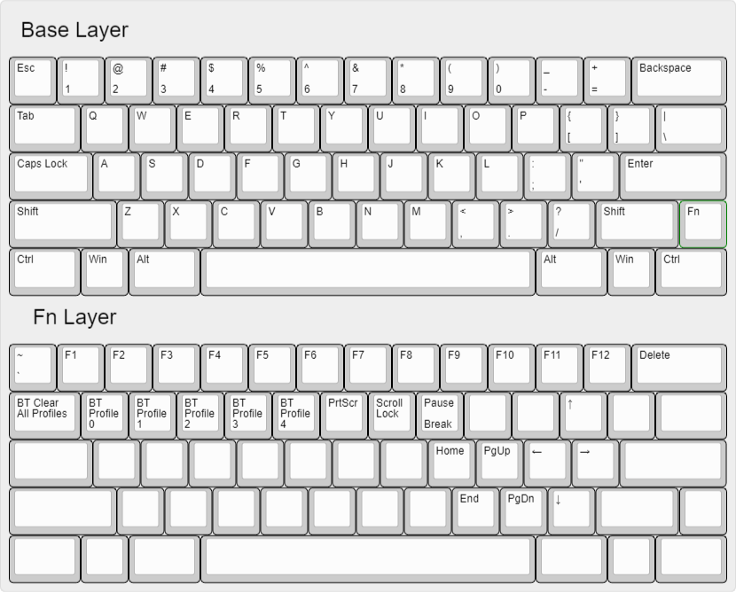
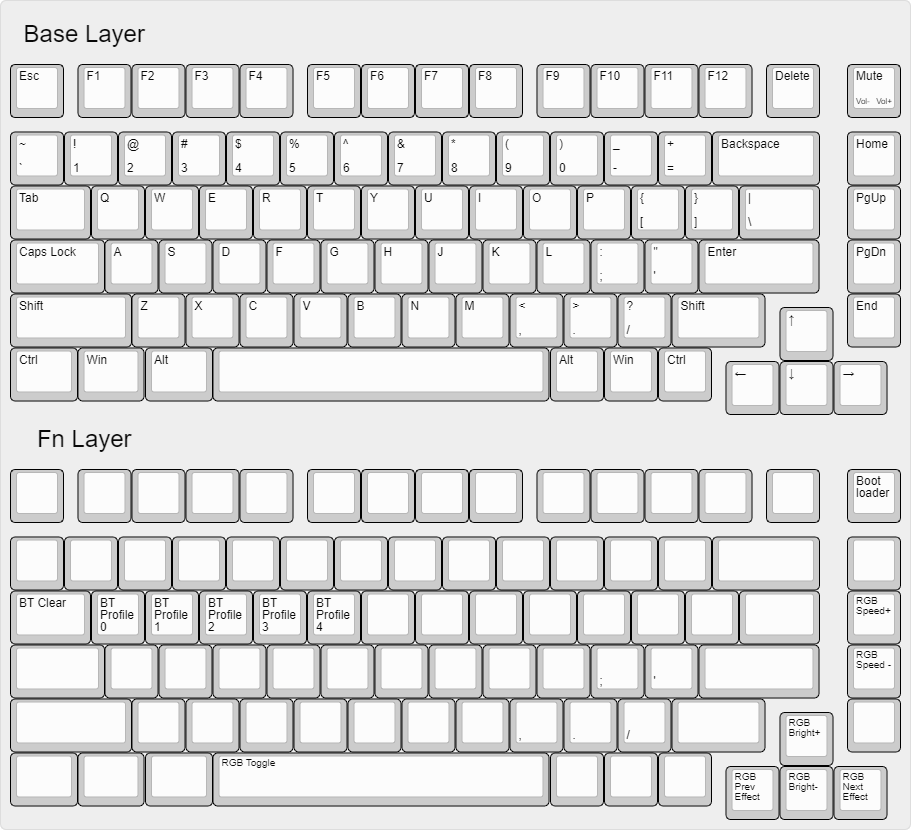

# BLErry ZMK Configuration

This repository is for RMI-KB keyboards that use ZMK, specifically the BLErry series of boards. Any questions, feel free to ask in the relevant **BLErry** channel in the [RMI-KB discord server](https://discord.gg/hXcpWvg5zB).

## Known Issues

- When you do the tweezer test and you short two pins that are not part of your layout, the top left key will actuate.

    - For example with the default layout (unified backspace), if you test the right half of the split backspace, it will send Esc. This is probably a bug with ZMK.

- If you choose the HHKB bottom row layout, and then tweezer test Right Ctrl, this will make the keyboard unresponsive. Just unplug and plug again.

## BLErry60

Default BLErry60 layout:

1. Edit the `config/boards/arm/blerry60/layout.h` file to change the layout to suit your 

2. Edit the `config/boards/arm/blerry60/blerry60.keymap` file to change your keymap.
- https://zmkfirmware.dev/docs/behaviors/key-press
- https://zmkfirmware.dev/docs/behaviors/layers
and pretty much everything in the "Behaviors" section, plus
- https://zmkfirmware.dev/docs/codes/
Head over to the Actions tab at the top of the repository.

3. Click on the latest workflow run.

- If you did your keymap correctly, there should be a green checkmark to the left.
- Click on the relevant firmware file to download. Unzip it somewhere too.

4. Plug the USB connector in, and double press the reset button twice quickly (Has to be <500 ms apart).

- Drag and drop the UF2 file you unzipped to the mass storage device that appeared.
- I think it's named NRF52BOOT or something? Whatever the name, there should be a UF2 file inside. Don't delete or anything, just drag and drop the new `blerry60` firmware file to the mass storage device.

## BLErry75

Default BLErry75 layout:

Basically the same as above, except there is no room for customization (i.e. the layout is fixed).

You can edit the behavior of the rotary encoder by changing `sensor-bindings = <&inc_dec_kp XXXX YYYY;` in `config/boards/arm/blerry75/blerry75.keymap`. `XXXX` and `YYYY` are keycodes.