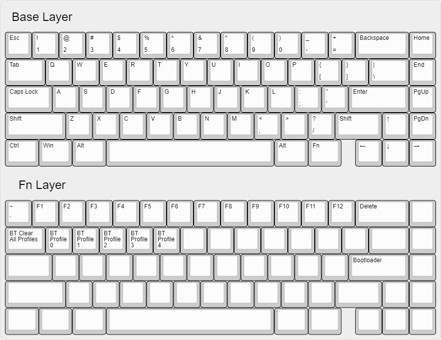
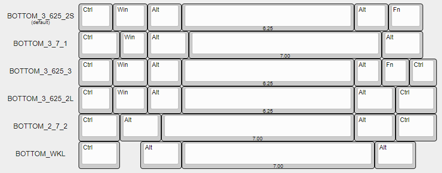

# BLErry ZMK Configuration

This repository is for RMI-KB keyboards that use ZMK, specifically the BLErry series of boards. Any questions, feel free to ask in the relevant **BLErry** channel in the [RMI-KB discord server](https://discord.gg/hXcpWvg5zB).

## Known Issues

- When you do the tweezer test and you short two pins that are not part of your layout, the top left key will actuate.

    - For example with the default layout (unified backspace), if you test the right half of the split backspace, it will send Esc. This is probably a bug with ZMK.

- If you choose the HHKB bottom row layout, and then tweezer test Right Ctrl, this will make the keyboard unresponsive. Just unplug and plug again.

- `BOTTOM_2_7_2` and `BOTTOM_WKL` layouts are not supported in the `ver. 5 Aug 2021` PCBs. (See below.)

## BLErry65

Default BLErry65 layout:

1. Edit the `config/boards/arm/blerry65/layout.h` file to change the layout to suit your needs.

- Above are the available bottom row layouts for BLErry65.
- Take note that **`BOTTOM_2_7_2` and `BOTTOM_WKL` are not available for PCBs marked with `ver. 5 Aug 2021`.**

2. Edit the `config/boards/arm/blerry65/blerry65.keymap` file to change your keymap.
- https://zmkfirmware.dev/docs/behaviors/key-press
- https://zmkfirmware.dev/docs/behaviors/layers
and pretty much everything in the "Behaviors" section, plus
- https://zmkfirmware.dev/docs/codes/
Head over to the Actions tab at the top of the repository.

3. Click on the latest workflow run.

- If you did your keymap correctly, there should be a green checkmark to the left.
- Click on the relevant firmware file to download. Unzip it somewhere too.

4. Plug the USB connector in, and double press the reset button twice quickly (Has to be <500 ms apart).

- Drag and drop the UF2 file you unzipped to the mass storage device that appeared.
- I think it's named NRF52BOOT or something? Whatever the name, there should be a UF2 file inside. Don't delete or anything, just drag and drop the new `blerry65` firmware file to the mass storage device.